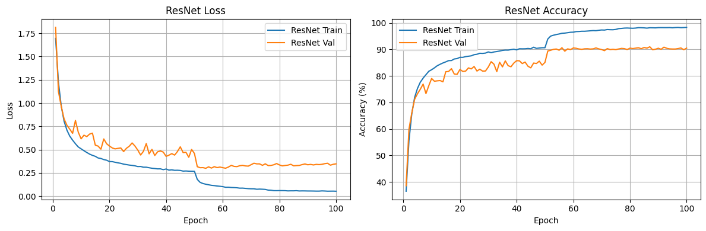
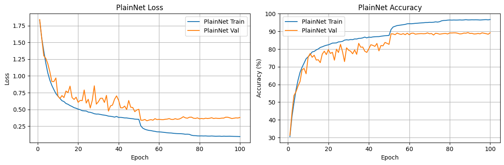
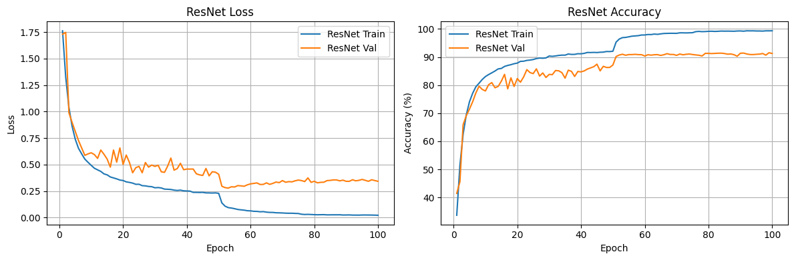
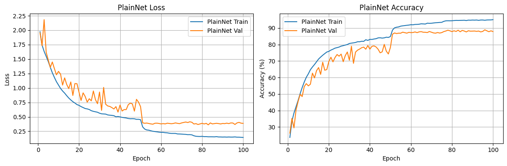
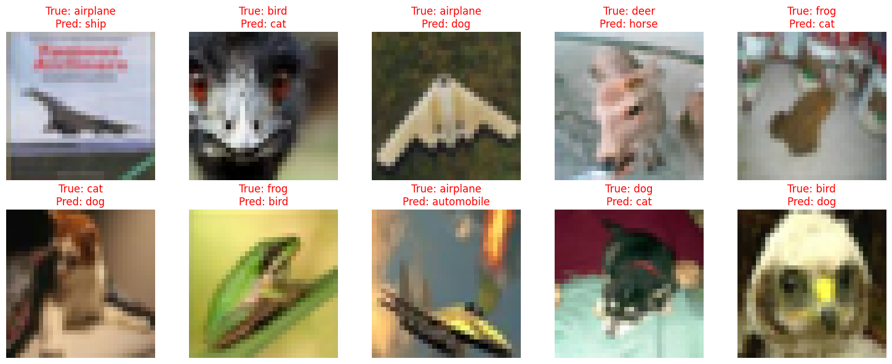
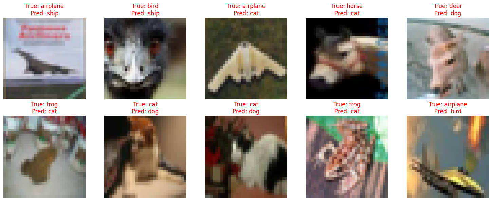

# Deep Learning Lab
A repository of small deep learning projects for educational purposes.

## Table of Contents
- [Deep Learning Lab](#deep-learning-lab)
  - [Table of Contents](#table-of-contents)
  - [Image Colorization with Autoencoder](#image-colorization-with-autoencoder)
    - [Overview](#overview)
    - [Features](#features)
    - [Dataset](#dataset)
    - [Implementation](#implementation)
    - [Results](#results)
    - [Future Work](#future-work)
  - [CIFAR-10 classification with ResNet](#cifar-10-classification-with-resnet)
    - [Project Structure](#project-structure)
    - [Dataset](#dataset-1)
    - [Model Architectures](#model-architectures)
    - [Training Setup](#training-setup)
    - [Data Augmentation](#data-augmentation)
    - [Results](#results-1)


## Image Colorization with Autoencoder
### Overview
This project implements an image colorization technique using an **autoencoder**. The model is trained to convert grayscale images into color images.

Source file: [image_colorization.ipynb](image_colorization.ipynb)


### Features
- **Autoencoders** are a type of neural network that learn to compress (encode) input data into a lower-dimensional representation and then reconstruct (decode) it back to the original form.
- In this project, the encoder maps grayscale input images to a compressed feature space, and the decoder reconstructs a colorized version of the image.
- The model is trained in a self-supervised fashion, as it learns to predict color channels from grayscale inputs.

### Dataset
The project uses the CIFAR-10 dataset, though any RGB image dataset (e.g., ImageNet, CelebA) can be adapted. Images are converted to grayscale and then used as inputs, while the original colored images serve as targets.

### Implementation
- **Preprocessing**: Convert RGB images to grayscale for input.
- **Model**: A convolutional autoencoder with encoder-decoder structure.

*Example of a convolutional autoencoder architecture. Source: https://www.digitalocean.com/community/tutorials/convolutional-autoencoder*
- **Loss Function**: Mean Squared Error (MSE) between the predicted and actual color images.
- **Training**: Uses mini-batch Adam optimization.

### Results 
- Evaluation of the model using MSE on a testing set.

- Example results of the autoencoder:


### Future Work
- Incorporate more complex architectures (e.g., U-Net, GANs) for better results.
- Train on larger and more diverse datasets.
- Explore colorization as a pretext task for representation learning.

## CIFAR-10 classification with ResNet
This project replicates the experimental setup from the "Deep Residual Learning for Image Recognition" paper (He et al., 2015), comparing the performance of ResNet and a plain CNN (PlainNet) on the CIFAR-10 image classification task.

*Source*: [resnet/cifar_classification.ipynb](resnet/cifar_classification.ipynb), [resnet/model.py](resnet/model.py)

### Project Structure
```graphql
resnet/
├── model.py             # ResNet and PlainNet model implementations
├── train.ipynb          # Full training pipeline (data, training, plots)
```

### Dataset
- CIFAR-10: 60,000 32×32 color images in 10 classes (50k train, 10k test)
- Downloaded automatically via torchvision.datasets.CIFAR10

### Model Architectures
- Resnet (with skip connections)
  - Residual blocks with projection shortcuts
  - 3 stages: [16, 32, 64] filters
  - Each block has 2 conv layers
  - Test the model with `blocks_per_stage` = {3, 5} giving 20 layers and 32 layers total.
- PlainNet:
  - Similar to ResNet architecture, but without residual connections
- Reference to Section 4.2 - CIFAR-10 and Analysis in the  "Deep Residual Learning for Image Recognition" paper (He et al., 2015) for full details.

### Training Setup
- Optimizer: SGD with momentum 0.9
- Weight Decay: 1e-4
- Learning Rate Schedule:
  - Initial: 0.1
  - LR decays by 10× at epoch 50 and 75
- Batch Size: 128
- Epochs: 100

### Data Augmentation 
- Random crop with 4-pixel padding
- Random horizontal flip
- Normalization using CIFAR-10 per-channel mean/std

### Results
- Training/Validation loss and accuracy of Resnet and PlainNet with 20 layers after 100 epochs:



- Training/Validation loss and accuracy of Resnet and PlainNet with 32 layers after 100 epochs:



- Testing loss and accuracy:

| Model       | Depth | Test Accuracy (%) | Test Loss |
|-------------|-------|--------------------|-----------|
| **ResNet**  | 20    | **90.07**          | 0.3781    |
| **PlainNet**| 20    | 89.13              | 0.4137    |
| **ResNet**  | 32    | **91.39**          | 0.3668    |
| **PlainNet**| 32    | 87.90              | 0.4122    |

- **Observation**: As depth increases, ResNet continues to improve in both accuracy and loss, while PlainNet begins to degrade — consistent with findings in the original ResNet paper.

- Some images misclassified by Resnet with 20 layers:


- Some images misclassified by Resnet with 32 layers:
