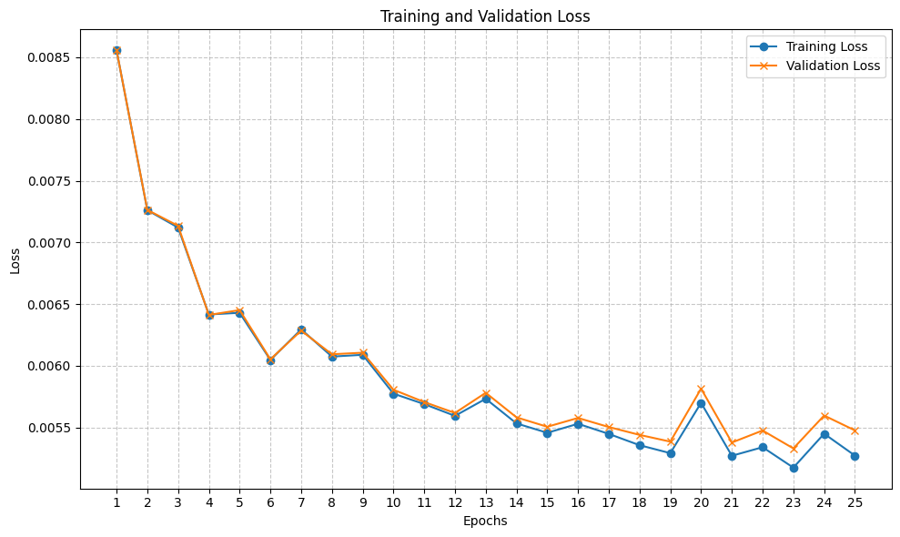

# Deep Learning Lab
A repository of small deep learning projects for educational purposes.

## Image Colorization with Autoencoder
### Overview
This project implements an image colorization technique using an **autoencoder**. The model is trained to convert grayscale images into color images.

Source file: [image_colorization/image_colorization.ipynb](image_colorization/image_colorization.ipynb)

### Features
- **Autoencoders** are a type of neural network that learn to compress (encode) input data into a lower-dimensional representation and then reconstruct (decode) it back to the original form.
- In this project, the encoder maps grayscale input images to a compressed feature space, and the decoder reconstructs a colorized version of the image.
- The model is trained in a self-supervised fashion, as it learns to predict color channels from grayscale inputs.

### Dataset
The project uses the CIFAR-10 dataset, though any RGB image dataset (e.g., ImageNet, CelebA) can be adapted. Images are converted to grayscale and then used as inputs, while the original colored images serve as targets.

### Implementation
- **Preprocessing**: Convert RGB images to grayscale for input.
- **Model**: A convolutional autoencoder with encoder-decoder structure.

*Example of a convolutional autoencoder architecture. Source: https://www.digitalocean.com/community/tutorials/convolutional-autoencoder*
- **Loss Function**: Mean Squared Error (MSE) between the predicted and actual color images.
- **Training**: Uses mini-batch Adam optimization.

### Results 
- Evaluation of the model using MSE on a testing set.

- Example results of the autoencoder:

### Future Work
- Incorporate more complex architectures (e.g., U-Net, GANs) for better results.
- Train on larger and more diverse datasets.
- Explore colorization as a pretext task for representation learning.